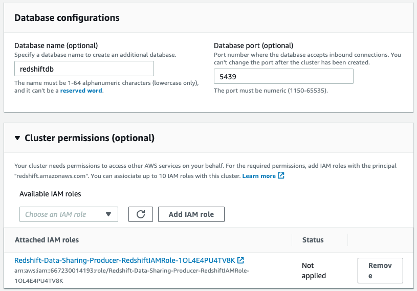
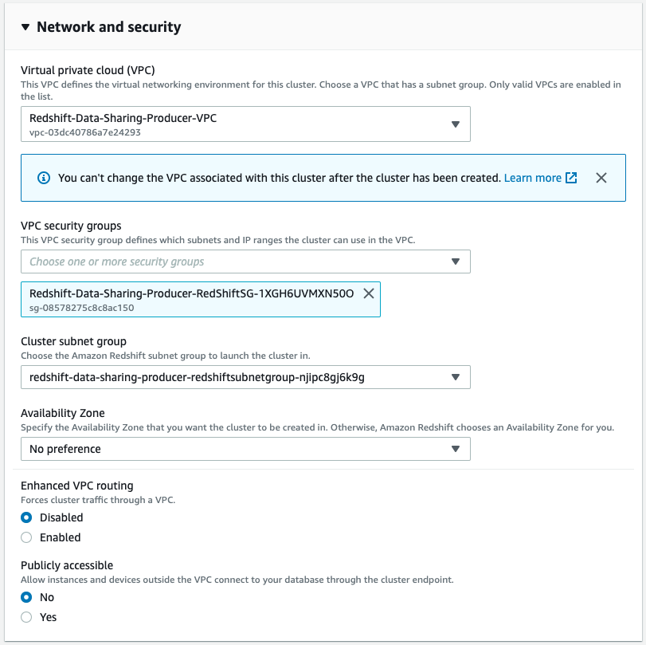

# Query live data in centralized Redshift Cluster from another cluster using the data sharing feature (preview)

[Amazon Redshift](https://aws.amazon.com/redshift/) is a fast, scalable, secure, and fully managed cloud data warehouse that makes it simple and cost-effective to analyze all your data using standard SQL. Amazon Redshift offers up to 3x better price performance than any other cloud data warehouse. Tens of thousands of customers use Amazon Redshift to process exabytes of data per day and power analytics workloads such as high-performance business intelligence (BI) reporting, dashboarding applications, data exploration, and real-time analytics. With [data sharing](https://docs.aws.amazon.com/redshift/latest/dg/datashare-overview.html), you can securely and easily share live data across Amazon Redshift clusters for read purposes. Data sharing improves the agility of your organization by giving you instant, granular, and high-performance access to data across Amazon Redshift clusters without your needing to manually copy or move it. With data sharing, you have live access to data so that your users can see the most up-to-date and consistent information as it's updated in Amazon Redshift clusters.  

Here we show how to create producer and consumer Redshift cluster, share date from the producer cluster to be immediately available in the consumer cluster right away.

## Solution Overview

In order for us to build this solution we need to do the following.

* [Create VPC with public and private subnets](https://docs.aws.amazon.com/batch/latest/userguide/create-public-private-vpc.html) to create our own network where we can create the resources.
* [Create Amazon Redshift Cluster in private subnet](https://docs.aws.amazon.com/redshift/latest/gsg/rs-gsg-launch-sample-cluster.html) in the private subnet of the VPC to make sure its not reachable from the internet.
* [Create DB objects and load data](https://docs.aws.amazon.com/redshift/latest/dg/tutorial-loading-data-create-tables.html)
* [Create a datashare](https://docs.aws.amazon.com/redshift/latest/dg/r_CREATE_DATASHARE.html) in the producer cluster to be shared with the consumer cluster
* Verify and run query from the consumer cluster.

## Solution Architecture

The [announcement blog](https://aws.amazon.com/blogs/big-data/announcing-amazon-redshift-data-sharing-preview/) does explains how the live data sharing works between 2 redshift clusters, and typical use cases.

## Pre-requisites
- [Create AWS Account](https://aws.amazon.com/premiumsupport/knowledge-center/create-and-activate-aws-account/)
- Familiarity with [Amazon Redshift](https://aws.amazon.com/redshift/), [Amazon S3](https://aws.amazon.com/s3/)

## Things to be aware of

1. Amazon Redshift data sharing doesn't support sharing stored procedures or Python user-defined functions. Only SQL user-defined functions are supported.
2. Amazon Redshift data sharing doesn't support concurrency scaling for queries that query for shared objects.
3. Amazon Redshift data sharing doesn't support cross account data share as yet but the preview will be out soon.
4. CloudFormation does not support ra3.xlplus instances
5. Need to use a cross database query notation (\<shareddatabase\>.\<schema\>.\<object\>)
6. Currently  the live data sharing will not work if the producer cluster is paused or under maintenance. But this feature will also preview soon.

----

## 1. Run the CloudFormation Template to create producer cluster
In order to automate the creation of resources you run the [AWS CloudFormation](https://aws.amazon.com/cloudformation/) template to create all the AWS resources. The below cloudformation creates the following.

 * VPC with private and public subnet
 * Redshift Cluster
 * Redshift cluster credentials in secret manager
 * Redshift IAM role
 * S3 bucket for uploading test data
    

After clicking on the on the _*Launch Stack*_ it wil take you the _*Create stack*_ page, click _*Next*_ to move to the next page.

In the _*Specify stack details*_ enter the Class B as 0 and choose the _*Redshift Cluster NodeType*_ and _*Choose the number of nodes for the Redshift Cluster*_ of your choice.

Acknowledge and click through Step 3 and Step 4 to create the stack.

----

## 2. Run the CloudFormation Template to create consumer cluster

In order to automate the creation of resources you run the [AWS CloudFormation](https://aws.amazon.com/cloudformation/) template to create all the AWS resources. he below cloudformation creates the following.

 * VPC with private and public subnet
 * Redshift Cluster
 * Redshift cluster credentials in secret manager

        

After clicking on the on the _*Launch Stack*_ it wil take you the _*Create stack*_ page, click _*Next*_ to move to the next page.

In the _*Specify stack details*_ enter the Class B as 1 and choose the _*Redshift Cluster NodeType*_ and _*Choose the number of nodes for the Redshift Cluster*_ of your choice.

Click through Step 3 and Step 4 to create the stack.

----

## 3. Snapshot the Producer, Consumer cluster and re-create them from the snapshot as ra3 cluster under PREVIEW_2020 maintenance track

The reason for doing is because in order to test ths preview feature new Amazon Redshift clusters must be created with the PREVIEW_2020 maintenance track.

For the both the producer and consumer cluster, from the Redshift console, chose the cluster. From the _*Acions*_ drop down choose the _*Delete*_ option. 

Choose the option to _*Create final snapshot*_ and the click _*Delete cluster*_.

Locate the snapshot for producer and consumer and click _*Restore from snapshot*_

While restoring both the producer and consumer choose the _*Node type*_ as ra3 family.

Choose the correct DB name as specified by the _*Outputs*_ tab of the respective CloudFormation templates.
Choose the appropriate IAM role for the producer cluster while leave it blank for the consumer cluster.

Choose the respective _*VPC*_, _*security groups*_, _*subnet group*_ as specified by the _*Outputs*_ tab of the respective CloudFormation templates.

Under Maintenance choose the _*Maintenance track*_ as _*Preview*_ and the value as _*preview_2020*_. Then select _*Restore cluster from snapshot*_.

----

## 4. Log On 

The DB name for both the produce and the consumer cluster is _*redshiftdb*_. as denoted by the key, _*RedshiftClusterDBName*_ in the _*Outputs*_ tab of the CloudFormation stacks of the Producer and Consumer.

Navigate the AWS Secrets Manager screen and locate the respective secrets as denoted by the _*Key*_, _*RedshiftClusterSecret*_ in ClodFormation _*Outputs*_ tab. Click on _*Retrieve secret value*_ to get the cluster credentials.

Use the [Redshift Query Editor](https://aws.amazon.com/blogs/big-data/query-your-amazon-redshift-cluster-with-the-new-query-editor/) to connect and query the redshift cluster.

----

## 5. Upload test data, crate tables, copy data

After logging in to the producer cluster, use the [link](https://docs.aws.amazon.com/redshift/latest/dg/tutorial-loading-data-create-tables.html)

* Step 1 : Download the data file from [here](https://docs.aws.amazon.com/redshift/latest/dg/tutorial-loading-data-download-files.html)
* Step 2 : Upload the test files to the S3 bucket as indicated by the key, _*RedshiftS3Bucket*_ in the _*Outputs*_ tab of the producer cloudformation stack. Create folders, _*customer-fw*_, _*dwdate-tab*_, _*part-csv*_ for their respective files. 
* Step 3 : Run [create_sample_tables.sql](sqls/create_sample_tables.sql) to create the sample tables.
* Step 4 : Get the S3 bucket and IAM Role as indicated by the keys _*RedshiftS3Bucket*_, _*RedshiftCopyIAMRole*_ in the _*Outputs*_ tab of the producer cloudformation stack. Run [copy_sample_tables.sql](sqls/copy_sample_tables.sql) to copy the sample tables.

----

## 6. Create Share in the producer cluster

From the Redshift dashboard, click the _*CLUSTERS*_ side bar to list the clusters and get the _*Cluster namespace*_ of the consumer cluster.

Run the [create_share.sql](sqls/create_share.sql) in the producer cluster with the consumer _*Cluster namespace*_ to create a share and provide access to the consumer cluster.

----

## 7. Query the share from consumer

Note the producer _*Cluster namespace*_ and run [consume_share.sql](sqls/consume_share.sql) in the consumer cluster to verify access of the share, create DB on the share, and a user.

Reconnect to the consumer cluster DB, redshift using the user created above and run [query_consumer_share_db.sql](sqls/query_consumer_share_db.sql) to verify that the DB user can query the shared DB.

----

## 8. Resources

1. [Amazon Redshift Data Sharing Workflow](https://www.youtube.com/watch?v=EXioFirlrnA)
2. [Amazon Redshift Data Sharing Use Cases](https://www.youtube.com/watch?v=sIoTB8B5nn4)
3. [AWS on Air 2020: Amazon Redshift Data Sharing and Isolation](https://www.youtube.com/watch?v=zK5X8ARsKDM)
4. [Announcing Amazon Redshift data sharing (preview)](https://aws.amazon.com/blogs/big-data/announcing-amazon-redshift-data-sharing-preview/)
5. [Sharing Amazon Redshift data securely across Amazon Redshift clusters for workload isolation](https://aws.amazon.com/blogs/big-data/sharing-amazon-redshift-data-securely-across-amazon-redshift-clusters-for-workload-isolation/)

----

## Clean Up

Post testing, clean up all resource created to avoid incurring charges when resources are not in use.

----

## Conclusion

We showed you how you provide workload isolation by allowing multiple consumers to share data seamlessly without the need to unload and load data. 

## Code of Conduct

See [CODE_OF_CONDUCT](CODE_OF_CONDUCT.md) for more information.

## Contributing Guidelines

See [CONTRIBUTING](CONTRIBUTING.md#security-issue-notifications) for more information.

## License

This library is licensed under the MIT-0 License. See the [LICENSE](LICENSE) file.